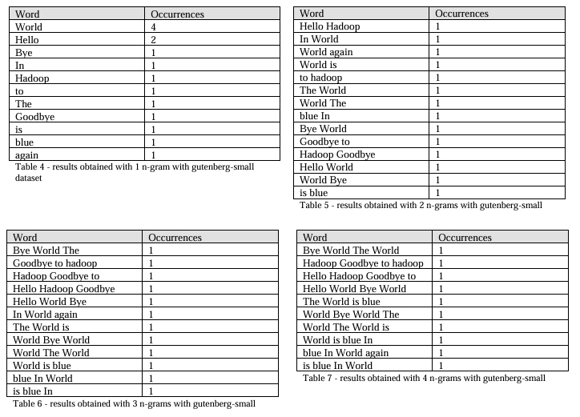
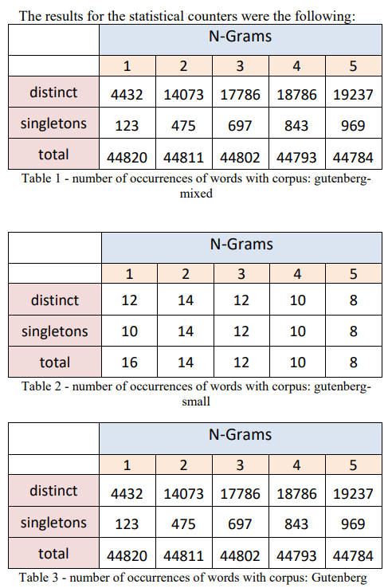

# Apache Hadoop Word count problem 

This project implements MapReduce programming model using Apache Hadoop to count words in n-grams in text files. The goal is to produce relevant statistical information, such as tables of n-grams, percentage of n-grams, occurrences of singletons, and the calculation of the TF-IDF statistical metric.

The system follows the diagram:

The results are:
<table>
  <tr>
    <td></td>
    <td></td>
</tr>
  <tr>
    <td style="text-align: center;"><em>1. Results for Guttenberg-small with multiple n-grams </em></td>
    <td style="text-align: center;"><em>2. Results with multiple Gutenberg texts</em></td>
  </tr>
</table>